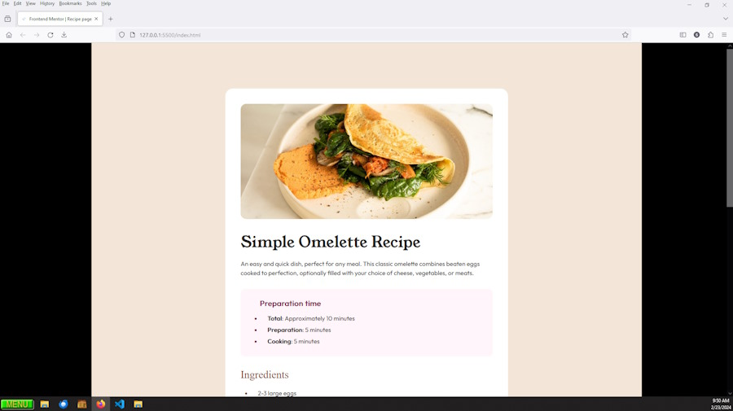

# Frontend Mentor - Recipe page solution

This is a solution to the [Recipe page challenge on Frontend Mentor](https://www.frontendmentor.io/challenges/recipe-page-KiTsR8QQKm). Frontend Mentor challenges help you improve your coding skills by building realistic projects. 

## Table of contents

- [Overview](#overview)
  - [The challenge](#the-challenge)
  - [Screenshot](#screenshot)
  - [Links](#links)
- [My process](#my-process)
  - [Built with](#built-with)
  - [What I learned](#what-i-learned)
  - [Continued development](#continued-development)
  - [Useful resources](#useful-resources)
- [Author](#author)
- [Acknowledgments](#acknowledgments)

## Overview

### Screenshot

### Links

- Solution URL: (https://madartistphoto.github.io/recipe-page-main/)

## My process

### Built with

- Visual Studio Code - using HTML5 & CSS3
- Mobile-first workflow
- ZonerX (for viewing the supplied images)
- Paint.net (for creating the Screenshot image)
- GitHub Pages
- GitHub (still very un-intuitive, but I'm learning)

### What I learned (and am learning)

-DO NOT START CODING ON THE COMPUTER.

-I printed out the designs, both desktop and mobile. That gave me a visual of the finished product I could reference without interuppting anything on my screens. It also gave me a place I could make notes about layout.

-Formattiing the <li> items was a challenge. Changing the color of the list bullets and numbers, and setting seperate margins and padding for the bullets/numbers and items took a bit of research.

-I used a <table> for the Nutrition data. Getting the layout right took a bit of tweaking.

-I had an issue with 
 sizes being larger than their declared size (ie; width:300px would actually be about 330px wide on the screen). It took a while to chase it down. I forgot that I had changed the magnification on Firefox to 110% (combination of old eyes and large hi-res monitor makes the standard browser text small).

### Continued development

-I know I need to do a lot more pre-planning before I open up Visual Studio Code. In a Computer Programming class I took about 40 years ago the teacher taught us to write out the programs by hand on paper with a pencil, and to visualize it step by step as we did so. It actually made it easier to follow the logic, and to make notes and changes on the paper than doing it on the screen.

### Useful resources

- W3School - Yeah, many people give them grief for being simplistic or out-dated. But starting out with Frontend Mentor doesn't require cutting edge coding. They are a good source for the basics.

## Author

- Website - [My Frontend Mentor Landing Page](https://madartistphoto.github.io/FM-Landing-Page/)
- Frontend Mentor - [John](https://www.frontendmentor.io/profile/MadArtistPhoto))

## Acknowledgments

Search the Internet to learn how to create websites for the Internet. Ain't technology wonderful.
